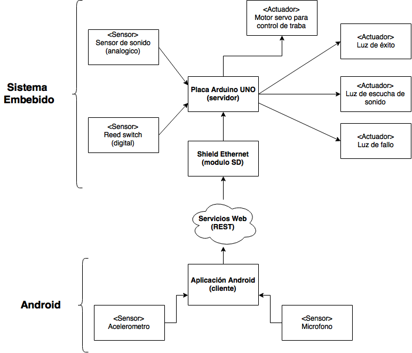

# PUERCOS - Sistema embebido

## Objetivo

Desarrollar un sistema de apertura/cerradura para una puerta mediante la deteccion de sonidos (palmadas o golpes en la misma puerta), de tal manera que la puerta se abra cuando el sistema, no solamente detecte la cantidad de sonidos especifica sino tambien se respete el tiempo entre cada sonido, como si fuera un codigo.

## Hardware Utilizado

* Placa Arduino UNO
* Cable USB
* Protoboard
* Cables para conexión (macho-macho y hembra-macho)
* Tarjeta micro SD
* Sensor de sonido
* Reed Switch
* Servo motor
* Luces de led (rojo, amarillo y verde)
* Arduino Ethernet Shield
* Cable Ethernet RJ45
* Router

## Software Utilizado

* Arduino IDE

## Implementación

Para la parte de embebidos, se conectaron a la placa los sensores: de sonido y reed switch, también como actuadores, las luces de led y el servo motor.
El sistema solo detecta sonido cuando la puerta está cerrada. Para esto pusimos un imán en la puerta para ser detectado el reed switch, de esta forma se sabe cuando la puerta está cerrada. Mientras la puerta está cerrada y se está escuchando sonidos la luz amarilla está encendida.
El sensor de sonido, que si bien es analogico, lo usamos digitalmente (hay sonido o no hay sonido), y cada vez que detecta un sonido se incrementa un contador (y la luz amarilla parpadea), sin embargo hay que respetar el tiempo entre cada sonido, para lo cual tenemos un vector donde se guardan los tiempos entre cada sonido. Después de un sonido, se cuenta el tiempo transcurrido y si no es igual al tiempo que está guardado en la posición correspondiente en el vector (más menos una tolerancia) el código se considera erróneo y se prende la luz roja. Se incluyó la tolerancia porque si no es muy difícil acertar el código.
Cuando el sistema detecta la cantidad correcta de sonidos (y por supuesto que se haya respetado el tiempo entre cada uno), se prende la luz verde y el servomotor gira para abrir la cerradura. Si la puerta se abre, el servo motor cerrará la cerradura una vez que la puerta se cierre, pero si la puerta no se abre y pasan 5 segundos el servomotor cierra la cerradura.

## Fotos del sistema embebido

## Demostración

Existe una demostración del uso del sistema en Youtube [Aquí](https://www.youtube.com/playlist?list=PL9De0fVBziHnb5U5nDkVhhY5CRz4T4JJC)

## Nosotros somos

* Fernando Martín Ortiz. ortizfernandomartin@gmail.com
* Nahuel Roldán. nahu.jose.roldan1990@gmail.com
* Agustín Emmanuel Bravo. agusbravolg@gmail.com
